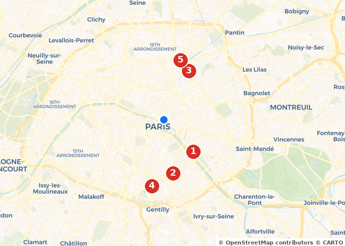

# ⛽⚡ EnerGoMap_bot

> 🤖 Bot Telegram qui trouve les **stations-service les moins chères** et les
> **bornes de recharge électrique** autour de vous, avec distances **en
> voiture** 🚗 et carte annotée 🗺 — données officielles françaises 🇫🇷 en
> temps réel.


---

## ✨ Fonctionnalités

| | |
|---|---|
| 🎛 **Zéro friction** | Tout se fait avec des boutons — aucun texte à taper |
| 📍 **Position native** | Partage de localisation Telegram en un appui |
| ⛽ **6 carburants** | Gazole, SP95, SP95-E10, SP98, E85, GPLc |
| ⚡ **Bornes électriques** | 227 000+ points de charge (puissance, prises, opérateur) |
| 🚗 **Distance réelle** | Itinéraire routier (OSRM), pas le vol d'oiseau |
| 🗺 **Carte annotée** | Top 5 numéroté sur une carte générée à la volée |
| 📊 **Stats nationales** | Min / médiane / max France pour chaque carburant |
| 🧭 **Navigation 1-clic** | Google Maps · Apple Plans · Waze |
| ⚠️ **Ruptures détectées** | Les stations en rupture sont exclues et signalées |
| 🔒 **RGPD friendly** | Votre position n'est **jamais** enregistrée |

## 🖼 Aperçu

Le bot répond en **un seul message** : carte + classement + boutons de
navigation.

<p align="center">
  
</p>

```
⛽ Gazole — top 5 autour de vous
🇫🇷 National : min 1.797 € · médiane 1.989 € · max 2.800 €

1️⃣ 36 Quai de la Rapée, Paris
     2.033 € — 3.6 km 🚗 9 min — il y a 2 h
2️⃣ 181 Boulevard Vincent Auriol, Paris
     2.024 € — 3.9 km 🚗 11 min — il y a 2 h
…
👇 Touchez un numéro pour lancer la navigation.
[ 1️⃣ ] [ 2️⃣ ] [ 3️⃣ ] [ 4️⃣ ] [ 5️⃣ ]
[ 🔄 Relancer ici ]
```

Un appui sur `2️⃣` → **choix de l'app** : `🗺 Google Maps` · `🍎 Apple Plans` ·
`🚗 Waze` — l'itinéraire s'ouvre directement dans votre application préférée.

## 🚀 Installation

### 1️⃣ Prérequis

- 🐍 **Python 3.10+** (`sudo apt install python3 python3-venv` sur Debian/Ubuntu)
- 🤖 Un **token de bot Telegram** : parlez à [@BotFather](https://t.me/BotFather),
  envoyez `/newbot`, suivez les instructions et copiez le token

### 2️⃣ Installation express (recommandée)

```bash
git clone https://github.com/VOTRE_COMPTE/EnerGoMap_bot.git
cd EnerGoMap_bot
./start.sh
```

Le script **fait tout** : ✅ vérifie Python → ✅ crée l'environnement virtuel
→ ✅ détecte les dépendances manquantes et **demande avant d'installer**
(`[O/n]`) → ✅ vous demande votre token au premier lancement → 🚀 lance le
bot (avec redémarrage automatique en cas de plantage).

### 3️⃣ Vérifier que tout marche

```bash
./start.sh --check     # 🩺 diagnostic complet
```

```
🩺 EnerGoMap_bot — diagnostic
========================================
🐍 Python
  ✅ Python 3.12.3
📦 Dépendances
  ✅ aiogram  ✅ httpx  ✅ staticmap  ✅ PIL  ✅ dotenv  ✅ aiosqlite
🔑 Configuration
  ✅ TELEGRAM_BOT_TOKEN — présent
🌐 APIs externes
  ✅ Telegram getMe — @VotreBot
  ✅ API carburants (data.economie.gouv.fr) — 37 stations à Paris 5 km
  ✅ API bornes IRVE (opendatasoft) — 227232 points de charge
  ✅ Routage OSRM (distances voiture)
🗺  Génération de carte
  ✅ Rendu PNG — 328 Ko
💾 Base de données
  ✅ SQLite initialisée
========================================
✅ Tout est opérationnel ! Lancez le bot : ./start.sh
```

### 🛠 Installation manuelle (alternative)

```bash
python3 -m venv .venv
.venv/bin/pip install -r requirements.txt
cp .env.example .env        # ✏️ éditez .env et collez votre token
.venv/bin/python bot.py
```

## 💬 Commandes du bot

| Commande | Action |
|---|---|
| `/start` | 👋 Onboarding ou menu principal |
| `/position` | 📍 Chercher autour de moi |
| `/carburant` | ⛽ Changer d'énergie (Gazole, SP95… ou ⚡) |
| `/stats` | 📊 Prix nationaux de tous les carburants |
| `/aide` | ℹ️ Aide et confidentialité |

## 🏗 Architecture

```
┌──────────┐  long polling  ┌─────────────────────────────────┐
│ Telegram  │ ◄────────────► │  bot.py (Python 3.12, aiogram 3)│
└──────────┘                │   ├─ handlers.py  (conversation) │
                            │   ├─ fuel_api.py  (⛽ prix ODS)  │
                            │   ├─ ev_api.py    (⚡ IRVE)      │
                            │   ├─ routing.py   (🚗 OSRM)      │
                            │   ├─ mapgen.py    (🗺 staticmap)  │
                            │   ├─ keyboards.py (🎛 boutons)    │
                            │   └─ db.py        (💾 SQLite)     │
                            └─────────────────────────────────┘
```

**Pipeline d'une recherche** : position 📍 → stations dans un rayon
adaptatif 5→30 km (API JSON) → filtrage ruptures & prix périmés → 1 requête
Matrix OSRM pour les distances voiture → scoring `prix + 0,5 × distance`
(normalisés) → top 5 → carte PNG → message composite.

## 📡 Sources de données

| Donnée | Source | Fraîcheur |
|---|---|---|
| ⛽ Prix carburants | [prix-carburants.gouv.fr](https://www.prix-carburants.gouv.fr) via [API data.economie.gouv.fr](https://data.economie.gouv.fr/explore/dataset/prix-des-carburants-en-france-flux-instantane-v2/) | ~10 min |
| ⚡ Bornes de recharge | [IRVE data.gouv.fr](https://www.data.gouv.fr/fr/datasets/fichier-consolide-des-bornes-de-recharge-pour-vehicules-electriques/) (consolidation Etalab) | quotidienne |
| 🚗 Routage voiture | [OSRM](https://project-osrm.org) (serveur démo — auto-hébergez pour la prod) | temps réel |
| 🗺 Fonds de carte | © [OpenStreetMap](https://www.openstreetmap.org/copyright) contributors · © [CARTO](https://carto.com/attributions) | — |

> 💶 **Note** : les *tarifs* de recharge électrique ne sont pas publiés en
> open data (grilles propres à chaque opérateur) — le bot affiche puissance,
> nombre de prises et opérateur, et vous renvoie vers l'app de l'opérateur
> pour le prix.

## 🔒 Confidentialité

- 📍 La position GPS est traitée **en mémoire uniquement**, jamais écrite en
  base ni dans les logs.
- 💾 Seuls sont stockés : votre ID Telegram et votre carburant préféré.
- 🔑 Le token du bot vit dans `.env`, exclu de git (`.gitignore`).

## 🗺 Feuille de route

- [x] ⛽ Carburants + ⚡ bornes électriques
- [x] 🗺 Carte annotée + navigation Google/Apple/Waze
- [ ] 🔌 Envoi direct de la destination à une **Tesla** (Fleet API, OAuth)
- [ ] 🔔 Alertes prix (« préviens-moi si le Gazole passe sous 1,65 € »)
- [ ] 🖥 OSRM auto-hébergé + webhook (montée en charge)

## 📄 Licence

[MIT](LICENSE) — faites-en bon usage 🙌

---

<p align="center">⭐ Un petit star si ce bot vous fait économiser quelques euros ! ⭐</p>
